# Formulary

**Source:** `ai-in-insurance/deloitte-artificial-intelligence-in-insurance/`
**Domain:** `ai-ins`
**One-liner:** A use-case formulary for insurance AI investment that admits a candidate only when its functionality, data, and addressed need are stated precisely, forces the portfolio to hold positions in discovery as well as efficacy, and closes each use case against benefit booked into the loss and expense ratios rather than benefit forecast in a business case.
**Wedge:** The first two years of an insurer's AI programme at a multi-line carrier with EUR 500M–5B gross written premium, entering through claims operations where the source shows the largest cost centre and the most mature applications, then extending to servicing, underwriting, and product.
**Positioning:** Portfolio discipline for a capability the industry has barely started buying. Consultancies sell the use-case longlist and vendors sell the model; Formulary is the standing register that turns a longlist into a governed portfolio — data readiness before build, a conduct gate before anything touches pricing or claims decisions, and a booked-benefit close that lets a Chief Data Officer retire a use case without retiring the programme.

## Market research synthesis

### Thesis from source

The paper's argument is that insurance has the industry's best raw material for AI and the worst record of acting on it. It reports that only 1.33 percent of insurance companies invested in AI in 2016, against 32 percent in software and internet technologies, while 95 percent of insurance executives intend to start or continue investing and 98 percent believe cognitive computing will play a disruptive role. It sets that against a market moving quickly — AI startup deals up 4.6 times from 150 in 2012 to 698 in 2016, USD 4.8B combined funding in 2016, projected overall spend of USD 47B by 2020 — and against insurtech competition: global venture funding of USD 1.7B across 173 deals in 2016 versus USD 0.14B across 28 deals in 2011. It quotes a Chief Underwriting Officer for EMEA saying "We have a lot of data but the question remains what to do with it," and reports that almost 40 percent of practitioners who have not yet invested in AI do not know what AI can be used for in their business. The bottleneck the paper identifies is therefore neither capital nor conviction nor technology. It is the inability to specify a use case.

Its answer is a formula, and the formula is the most reusable thing in the document: do x (functionality) based on y (data) in order to address z (need). Functionality is one of inform, recommend, or decide. Data is one of four types — company, public, third-party, and customer — each with materially different acquisition and permission costs, and the paper notes about 80 percent of data today is unstructured. Need is either an organisational need or an external customer need across product, communication, operations, cost, and convenience. The paper is explicit that performance for modern models depends more on the quantity and quality of data than on the algorithm, since many models are open source, and it supports this with a survey of 187 leading vendors classified by dominant model type: 31 recommendation engines, 27 pattern and anomaly detection, 26 text analytics and natural language processing, 19 natural language generation, 19 automatic decision management, with 43 vendors combining two dominant models and 10 combining three. The practical consequence is that a use case is only real if all three slots are filled, and that the data slot is the one that fails.

The second framework is a value map that sorts use cases on two axes: whether the result is known or unknown, and whether the impact is bottom-line or top-line. That produces four quadrants — operations efficacy, customer efficacy, operations discovery, customer discovery. The paper's central finding about insurers is positional: they are clustered almost entirely in the two efficacy quadrants and largely absent from discovery. It evidences the efficacy side with real numbers. Fukoku Mutual Life's claims application raised productivity 30 percent with expected payback under two years and annual savings of JPY 140M, and still routes the calculated pay-out to a staff member who approves and releases it. Aetna's assistant answers around 20,000 questions daily and improved from high-quality answers 35 percent of the time to 80 percent within a year. Basler automates parts of glass damage claims including payments; Zurich UK piloted injury claims automation; Versicherungskammer Bayern classifies customer email. Outside insurance it cites JP Morgan's COIN saving 360,000 hours of lawyer and loan officer work, The North Face reaching 60 percent click-through, Korean Air cutting maintenance lead times 90 percent, and Netflix originals rating 11 percent higher than licensed content.

For discovery it can only point outside the industry, and that absence is the product's reason to exist. Oscar uses claims data to infer which doctor performs which procedure at what frequency and refer patients to genuine specialists. Stanley Black & Decker used generative design to redesign an electrician's tool that had been almost 7 kg, which the paper translates into designing new insurance policies from prior policies, customer feedback, claims data, public data, and customer data to reach market faster and cheaper. Under Armour's cognitive coach becomes, in the paper's translation, suggesting risk prevention measures so that insurers are "no longer confined to reimbursing materialised risk but instead prevent loss events from occurring in the first place." Its closing advice is operational: data is the key, start small, and do not be afraid of failure, adopting a fail-fast mindset to keep time and cost investment in check. That produces a clear product: a governed register where each candidate carries its formula and its quadrant, cannot pass without a data-readiness verdict, must clear conduct review before touching a rating factor or a claim decision, is deliberately balanced so the portfolio is not entirely efficacy, and is closed against benefit that finance has actually booked.

### Buyer & economic model

- **Primary buyer:** Chief Data and Analytics Officer, or the COO where no such role exists, with the Chief Financial Officer as co-signatory because the benefit claim lands in the combined ratio.
- **Users:** use-case sponsors from claims, underwriting, servicing, product, and finance (per candidate); data owners and stewards (at readiness assessment); data scientists and delivery leads (during build); actuarial and pricing leads (on any use case touching rate); conduct, legal, and data protection officers (at gate review); internal audit and model risk (periodic); the executive investment committee (quarterly).
- **Budget owner / value metric:** the AI and data investment envelope. The value metric is booked benefit per euro of investment, split into loss-ratio points, expense-ratio points, and premium or retention effect, plus a portfolio-level measure the source implies directly — the share of committed spend sitting in discovery rather than efficacy, since a portfolio entirely in efficacy has capped its own upside at cost reduction.
- **Competing status quo:** a consultant-produced use-case longlist in a slide deck, an innovation backlog in a project-management tool, business cases in individual spreadsheets owned by sponsors, a separate model inventory maintained for regulatory purposes, and benefits tracking that stops at go-live. Nothing in that arrangement can tell an executive committee which of forty candidates has usable data, which quadrant the portfolio is over-weighted in, or whether last year's approved benefits ever appeared in the accounts.

### Domain constraints

- **Regulatory / trust / safety:** any use case that informs pricing, underwriting acceptance, or claims decisions enters regulated territory. Rating factors must be justifiable and free of proxies for protected characteristics, which makes postcode, occupation, and behavioural features conduct questions rather than feature-engineering questions. Fair-pricing expectations restrict what customer data may drive renewal price. Automated decisions materially affecting a policyholder require a route to human review. Model risk sits inside the own risk and solvency assessment, so an unregistered production model is a governance finding. Reserving and pricing use cases touch the actuarial function's opinions and cannot bypass them.
- **Data sensitivity:** the source's four data types carry four different permission regimes. Company data raises purpose-limitation questions when claims history is reused for marketing; public data raises accuracy and provenance questions; third-party data cannot be used without permission and carries onward-transfer terms; customer data from wearables, telematics, and smart home devices requires consent that is line-specific and revocable. The paper's own figures show willingness to share behavioural data at 48 percent for motor, 40 percent for health, and 38 percent for home, so any use case whose value depends on customer data must be sized on realistic coverage rather than the whole book.
- **Change-management realities:** the paper's finding that 40 percent of non-investors do not know what AI is for means the first constraint is specification literacy, not model access. Sponsors will submit solutions rather than needs. The efficacy bias is self-reinforcing because efficacy benefits are easy to compute and discovery benefits are not, so the portfolio drifts to cost cutting unless balance is a policy. The fail-fast advice only works if a kill is politically survivable, which requires kill criteria agreed at admission rather than negotiated at review. And the source's own honesty about legacy — insurers already have partial automation in quotation, contract, and claims — means most candidates are increments on existing capability whose incremental benefit must be isolated.

## Business requirements

- BR-1: A candidate may not be admitted to the portfolio without a complete formula stating the functionality as inform, recommend, or decide; the data by type and source; and the specific organisational or customer need addressed.
- BR-2: Every candidate must be assigned a value quadrant on the known-versus-unknown result axis and the bottom-line-versus-top-line impact axis, and the portfolio must hold a stated minimum share of committed investment in discovery quadrants.
- BR-3: No candidate may enter build before a data-readiness verdict covering availability, quality, permission basis, and expected coverage of the in-force book, and a candidate dependent on customer-supplied behavioural data must be sized on realistic consent coverage rather than total policy count.
- BR-4: Any use case that would inform pricing, underwriting acceptance, renewal price, or claims decisions must clear a conduct gate before build, and the gate must test for proxy discrimination in the proposed feature set.
- BR-5: Benefit must be stated at admission in the insurer's own financial language — loss-ratio points, expense-ratio points, premium, or retention — and closed against benefit confirmed by finance, with forecast benefit never reported as realised.
- BR-6: Every candidate must carry kill criteria and a decision date agreed at admission, and a candidate that meets its kill criteria must be closed rather than re-scoped, so the fail-fast principle is enforced structurally.
- BR-7: Where a candidate extends existing partial automation, its benefit claim must isolate the increment above the current baseline, so that legacy straight-through processing benefit is not recounted.
- BR-8: Every model in production must be registered with its owner, its use cases, its data dependencies, and its conduct-gate outcome, and any production model without a registered owner must be treated as an incident.
- BR-9: Cross-industry analogues used to justify a candidate must be recorded with the transfer assumption made explicit, so that an insurance business case is not carried by a manufacturing or media result.
- BR-10: The portfolio must publish a first-release size limit so that candidates start small and scale on evidence, and a candidate exceeding that limit at admission must be decomposed before approval.
- BR-11: Third-party and public data dependencies must record their permission basis, onward-transfer terms, and renewal date, so that a use case cannot silently lose its legal basis mid-life.
- BR-12: The portfolio must report quarterly to the investment committee on committed spend, quadrant balance, booked benefit, kills, and data-readiness failure reasons, and that report must be the sole basis for further funding release.

## User stories

Canonical user stories live in sibling [USER_STORIES.md](USER_STORIES.md).

## System design

### Overview

Formulary is a governed register with gates. A candidate enters through an intake that will not accept it until the three slots of the formula are filled — functionality, data, need — and is immediately positioned on the value map. From there it passes three gates in order. Data readiness assesses availability, quality, permission basis, and expected coverage of the in-force book per data dependency, and returns a verdict with reasons; a fail sends the candidate back with a named data blocker rather than a vague deferral. The conduct gate is triggered by the candidate's own declared touchpoints — rating, renewal price, acceptance, claims decision — and reviews the proposed feature set for proxy risk and the benefit logic for prohibited pricing practices. The investment gate sizes the first release against a portfolio-wide small-start limit, fixes kill criteria and a decision date, and books an expected benefit in loss-ratio, expense-ratio, premium, or retention terms. Delivered use cases then register their production models and enter a benefit-close cycle in which finance confirms or denies the claimed movement. The portfolio view aggregates all of it: committed spend by quadrant, realised versus forecast benefit, kills and their reasons, and the recurring data blockers that tell the organisation what to fix next.

### Actors & boundaries

- **Actors:** Chief Data and Analytics Officer, business sponsor, data owner and steward, delivery lead, pricing actuary, conduct and data protection officer, model risk reviewer, finance business partner, investment committee, internal audit.
- **Trust boundary:** Formulary holds the candidate, the formula, the gates, the registrations, and the benefit close; it does not hold customer data, model artefacts, or training pipelines. Data readiness is asserted by the accountable data owner against catalogued metadata, not by inspecting records. The model register points at models operated elsewhere. Benefit is asserted by finance from the general ledger, so the portfolio can never mark its own homework.
- **Human-in-the-loop points:** intake acceptance of the formula; data-readiness verdict; conduct-gate approval or withholding; actuarial review of proposed rating features; investment approval and first-release sizing; kill decision at the agreed date; finance confirmation of booked benefit; audit sampling of the model register.

### Core capabilities

1. **Formula intake** — enforces the functionality, data, and need triple, and blocks solution-first submissions.
2. **Value map positioning** — assigns quadrant on result type and impact type, and maintains portfolio balance against target.
3. **Data readiness assessment** — per-dependency verdict on availability, quality, permission basis, structure, and coverage of the in-force book.
4. **Conduct and actuarial gate** — routes candidates by declared touchpoint, tests feature sets for proxy risk, records approval, conditions, or withholding.
5. **Investment sizing and kill criteria** — first-release limit, expected benefit in insurance financial terms, kill criteria, and decision date.
6. **Analogue transfer library** — cross-industry and cross-insurer cases with the explicit assumption required to carry them into this insurer's context.
7. **Model and dependency register** — production models, owners, data dependencies, permission renewal dates, and gate outcomes.
8. **Benefit close** — finance-confirmed movement in loss ratio, expense ratio, premium, or retention, with baseline isolation for increments on existing automation.
9. **Portfolio reporting** — committed spend, quadrant balance, booked versus forecast benefit, kill log, and aggregated data-blocker analysis.
10. **Duplicate and adjacency detection** — surfaces existing delivered or in-flight use cases addressing the same need.

### Conceptual data

- **Primary entities:** UseCaseCandidate, Formula, FunctionalitySpec, DataDependency, NeedStatement, ValuePosition, DataReadinessVerdict, ConductGateReview, FeatureRiskFinding, InvestmentDecision, KillCriterion, FirstReleaseScope, AnalogueCase, ModelRegistration, BenefitClaim, BenefitClose, PortfolioBalanceTarget, DataBlocker.
- **Critical events:** candidate submitted, formula accepted or rejected, quadrant assigned, readiness verdict issued, conduct gate opened, feature risk finding raised, gate approved or withheld, investment approved with kill criteria, first release delivered, model registered, benefit claimed, benefit confirmed or denied by finance, kill criterion met, candidate closed, permission dependency expired.
- **Retention / audit needs:** gate reviews, feature risk findings, and conduct approvals must be retained for the life of the model plus the rate-filing and complaint window, because a rating factor challenged years later is defended by the design-time record. Investment decisions and benefit closes retain to the statutory accounting period and must reconcile to the ledger. Kill records are permanent, since the value of an enforced kill policy is the precedent. Data dependency records retain permission basis and renewal history for the duration of use plus the applicable data-protection accountability period.

### Integrations (conceptual)

- **Systems of record:** general ledger and management accounts for benefit confirmation, data catalogue and lineage tooling for dependency metadata, consent and preference management for permission basis and coverage, model operations platform for production model identity, project and resource management for delivery status, policy administration and claims systems for baseline volumes.
- **Upstream signals:** actuarial pricing and reserving reviews, rate-filing calendar, complaints and conduct incident feeds, vendor and third-party contract terms with renewal dates, insurtech and competitor case intelligence, internal audit findings on model inventory completeness.
- **Downstream actions:** funding release to delivery teams, conduct conditions attached to a build, kill notices and portfolio closure, model registration entries and owner assignment, data-blocker work requests into the data programme, quarterly investment committee pack, and evidence extracts for model risk and the own risk and solvency assessment.

### High-level architecture

The register is a gated pipeline whose gates are owned by different functions on purpose — the value of the design is that data readiness, conduct, and investment cannot be granted by the same person. Benefit close is deliberately outside the pipeline's control, sourced from finance, so the portfolio cannot certify its own results.

```mermaid
flowchart TD
    subgraph intake [Intake]
        Submit[Candidate submission]
        FormulaCheck["Formula completeness check"]
        Adjacency[Duplicate and adjacency detection]
        Quadrant[Value map positioning]
    end
    subgraph gates [Gates]
        Readiness[Data readiness assessment]
        ConductGate["Conduct and actuarial gate"]
        FeatureRisk["Proxy and feature risk review"]
        Investment["Investment sizing and kill criteria"]
    end
    subgraph delivery [Delivery and registration]
        FirstRelease[First release scope]
        ModelRegister[Model and dependency register]
    end
    subgraph closeout [Benefit close]
        BenefitClaimed[Benefit claim]
        FinanceConfirm[Finance confirmation]
        KillReview[Kill criteria review]
    end
    subgraph portfolio [Portfolio view]
        Balance[Quadrant balance and committed spend]
        Blockers[Aggregated data blockers]
        CommitteePack[Investment committee pack]
    end
    subgraph external [External sources]
        Catalogue[Data catalogue and lineage]
        Consent[Consent and permission records]
        Ledger[General ledger]
        Analogues[Analogue case library]
    end

    Submit --> FormulaCheck --> Adjacency --> Quadrant --> Readiness
    Catalogue --> Readiness
    Consent --> Readiness
    Readiness --> ConductGate
    ConductGate --> FeatureRisk
    FeatureRisk --> Investment
    Analogues --> Investment
    Investment --> FirstRelease --> ModelRegister
    ModelRegister --> BenefitClaimed
    Ledger --> FinanceConfirm
    BenefitClaimed --> FinanceConfirm
    FinanceConfirm --> Balance
    Investment --> KillReview
    KillReview --> Balance
    Readiness --> Blockers
    Balance --> CommitteePack
    Blockers --> CommitteePack
    ModelRegister --> CommitteePack
```

### Success metrics

- **Leading:** share of submitted candidates with a complete formula at first pass; median days from submission to readiness verdict; share of candidates with a conduct-gate outcome before build start; committed investment share in discovery quadrants against target; proportion of candidates with kill criteria and a fixed decision date; model register completeness against models found in production by audit; count of candidates stopped by a named data blocker rather than left dormant.
- **Lagging:** booked benefit as a share of forecast benefit at admission; loss-ratio and expense-ratio points confirmed by finance and attributed to the portfolio; kill rate and median time to kill, as the operational test of the source's fail-fast advice; number of use cases whose benefit survived a second annual review; proxy-discrimination findings caught at gate versus found after launch; portfolio position on the source's own diagnosis, measured as the shift of delivered use cases out of pure efficacy into discovery.

## OpenAPI skeleton

Canonical HTTP surface lives in sibling [openapi.yaml](openapi.yaml). Summary:

- **Base path:** `/v1/...`
- **Auth:** `X-API-Key` for data catalogue, ledger, and model-platform integrations; Bearer JWT for sponsors, gate owners, and committee users.
- **Resource groups:** Candidates, Readiness, Gates, Investment, Registry, Benefits, Portfolio.
