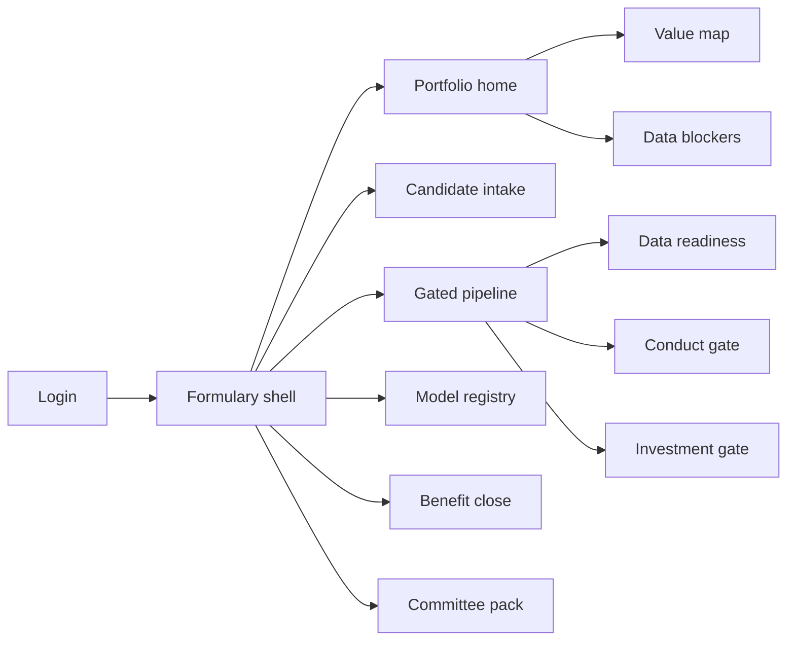
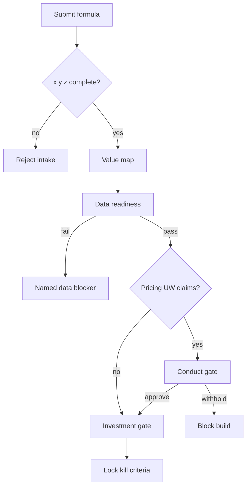

# Formulary — Web app

**Product:** [PRODUCT.md](./PRODUCT.md)
**Primary surface:** AI investment formulary console (CDAO / portfolio administrators)
**Secondary surfaces:** Gate workbenches (data readiness, conduct/actuarial); investment committee pack (read-only export); finance benefit-close affirmation
**Design thesis:** Formulary is a pharmacy-style register for AI use cases — nothing enters the book without a complete prescription: do *x* (functionality) on *y* (data) for *z* (need). The UI metaphor is a gated ledger and four-quadrant value map, not an innovation backlog kanban. Visual language is deep ink and prescription-blue on warm paper-white panels: incomplete formulas stay provisional amber; finance-booked benefit locks mint-green; forecast-only claims never wear the same badge. Discovery share of spend is a first-class dial so efficacy cost-cutting cannot silently own the envelope.

## UX research synthesis

### Category peers (best-in-class)

- **Productboard:** Structured intake, need-first prioritisation, and adjacency to existing features. Steal: guide sponsors from need → capability rather than solution dumps; reject feature-roadmap aesthetics that bury financial close.
- **Collibra / Alation (data catalogue UX):** Steward-owned readiness verdicts with reason codes and coverage. Steal: per-dependency readiness as a blocking gate with named blockers; reject “data available = green” without permission and book coverage.
- **ServiceNow GRC / IRM:** Multi-owner gated workflows with audit trail. Steal: sequential gates owned by different functions (readiness ≠ conduct ≠ investment); reject ITSM ticket chrome for executive portfolio reading.
- **ValidMind / Credo AI (model inventory patterns):** Production model register with owners and use-case linkage. Steal: unowned production model as incident; reject treating model risk as a separate orphan spreadsheet.

### Patterns to adopt / reject

- **Adopt:** Three-slot formula validator at intake; value-map quadrant with discovery minimum; data-readiness verdict before build; conduct gate on pricing/UW/claims touchpoints; kill criteria + date at admission; benefit close only via finance confirmation; analogue cases with explicit transfer assumptions; quarterly committee pack as sole funding basis.
- **Reject:** Slide-deck longlists as system of record; forecast benefit labelled “realised”; solution-first intake; single approver for all gates; purple “AI opportunity” scorecards; kanban that hides quadrant imbalance.

### Trust, density, and workflow constraints from PRODUCT.md

Rating, renewal, acceptance, and claims use cases are conduct-regulated (BR-4); proxy features must fail at design time. Four data types carry four permission regimes (BR-3, BR-11). Benefit language is loss/expense ratio points, premium, retention — never vanity AI KPIs (BR-5). Kill must be structural, not political (BR-6). Incremental benefit over legacy STP must be isolated (BR-7). Density is committee-grade on portfolio and gate screens; intake is conversational so the 40% who “don’t know what AI is for” can still specify a need.

## Information architecture

### Nav model

### Roles → default home

| Role | Default home | Why |
|------|--------------|-----|
| Chief Data / Analytics Officer | Portfolio home — quadrant balance + booked benefit | Envelope defence (BR-2, BR-12) |
| Business sponsor | Candidate intake / my candidates | Need-first specification (BR-1) |
| Data owner / steward | Readiness queue | Verdicts unblock or kill early (BR-3) |
| Conduct / pricing actuary | Conduct gate queue | Proxy risk before build (BR-4) |
| Finance business partner | Benefit close queue | Booked vs forecast (BR-5) |
| Investment committee | Committee pack | Sole funding basis (BR-12) |
| Model risk / audit | Model registry | ORSA inventory completeness (BR-8) |

### Cross-links to OpenAPI resources

| Nav area | OpenAPI tags / resources |
|----------|---------------------------|
| Candidates, formula, value position, adjacency | Candidates |
| Readiness verdicts, data blockers | Readiness |
| Conduct gate, feature risk | Gates |
| Investment, kill review | Investment |
| Models, data dependencies | Registry |
| Benefit claims and close | Benefits |
| Balance, committee pack, analogues | Portfolio |

## Screen inventory

### Portfolio home

- **Purpose:** One composition: are we balanced on discovery, and has finance booked what we claimed?
- **Entry:** CDAO login default; post-committee deep link.
- **Layout regions:** Brand + period selector; value-map heatmap (committed spend by quadrant vs target); booked vs forecast benefit; kill count; top data blockers; funding-release status.
- **Primary actions:** Open committee pack; drill quadrant; open blocker programme; open pipeline bottlenecks.
- **Empty / loading / error:** Empty portfolio = guided first candidate; error = retry with pack id.
- **BR / story ties:** BR-2, BR-5, BR-12; CDAO stories.

### Candidate intake (formula)

- **Purpose:** Admit only complete *functionality × data × need* formulas; block solution-first submissions.
- **Entry:** Sponsor CTA; nav → Intake.
- **Layout regions:** Three-slot formula builder (inform/recommend/decide; data types; need statement); adjacency hits; optional analogue attach with transfer assumption field.
- **Primary actions:** Submit for formula check; save draft; view similar delivered cases.
- **Empty / loading / error:** Incomplete slot = cannot submit; adjacency warning = soft, not block.
- **BR / story ties:** BR-1, BR-9; sponsor stories.

### Value map positioning

- **Purpose:** Place candidate on known/unknown × bottom/top-line and show portfolio balance impact.
- **Entry:** After formula accept; portfolio drill.
- **Layout regions:** Four-quadrant plot; candidate pin; projected discovery share if approved; target band.
- **Primary actions:** Confirm position; flag if admission would breach discovery minimum.
- **Empty / loading / error:** Unpositioned = cannot open investment gate.
- **BR / story ties:** BR-2.

### Gated pipeline board

- **Purpose:** See every candidate by gate stage with owning function visible.
- **Entry:** Portfolio admin / CDAO secondary home.
- **Layout regions:** Columns (intake → readiness → conduct → investment → delivery → close); SLA ageing; gate owner avatars.
- **Primary actions:** Open candidate; escalate stalled gate; filter by line of business.
- **Empty / loading / error:** Stalled beyond SLA = amber rail alert.
- **BR / story ties:** System design gates; BR-12 throughput.

### Data readiness assessment

- **Purpose:** Per-dependency verdict: availability, quality, permission, coverage of in-force book.
- **Entry:** Readiness queue; candidate deep link.
- **Layout regions:** Dependency list (company/public/third-party/customer); coverage vs consent reality; verdict + reason codes; named blockers.
- **Primary actions:** Pass / fail with reasons; raise data-blocker work request; size on realistic consent coverage.
- **Empty / loading / error:** Fail = return to sponsor with named blocker, not vague deferral.
- **BR / story ties:** BR-3, BR-11; data owner stories.

### Conduct and actuarial gate

- **Purpose:** Review pricing/UW/claims touchpoints and feature proxy risk before build.
- **Entry:** Auto-routed when touchpoints declared; conduct queue.
- **Layout regions:** Declared touchpoints; feature set; proxy findings; prohibited practice checks (e.g. renewal price sensitivity); approve / condition / withhold.
- **Primary actions:** Raise finding; withhold; approve with conditions attached to build.
- **Empty / loading / error:** Non-touching candidates skip with recorded N/A; withholding blocks investment.
- **BR / story ties:** BR-4; conduct/actuary stories.

### Investment sizing and kill criteria

- **Purpose:** First-release size limit, benefit in insurance financial language, kill criteria + decision date.
- **Entry:** After readiness (+ conduct if required).
- **Layout regions:** First-release scope vs portfolio limit; benefit fields (LR/ER/premium/retention); incremental-vs-baseline isolation; kill criteria editor; decision date; analogue transfer assumptions.
- **Primary actions:** Approve funding; force decompose if over size limit; lock kill criteria.
- **Empty / loading / error:** Oversize = cannot approve until decomposed (BR-10).
- **BR / story ties:** BR-5–7, BR-9, BR-10.

### Kill review

- **Purpose:** Enforce fail-fast: meet kill criteria → close, not re-scope.
- **Entry:** Decision date due; admin kill queue.
- **Layout regions:** Criteria checklist; evidence; close vs (disallowed) re-scope attempt log.
- **Primary actions:** Close candidate; record kill reason; notify sponsor.
- **Empty / loading / error:** Re-scope attempt = blocked with policy citation.
- **BR / story ties:** BR-6; portfolio administrator stories.

### Model and dependency register

- **Purpose:** Every production model has owner, use cases, data deps, conduct outcome; orphan = incident.
- **Entry:** Model risk / audit home; post-delivery registration.
- **Layout regions:** Model table; owner; linked candidates; permission renewal dates; incident banner for unowned models.
- **Primary actions:** Register model; assign owner; open dependency renewals.
- **Empty / loading / error:** Unowned production model = coral incident state.
- **BR / story ties:** BR-8, BR-11.

### Benefit close

- **Purpose:** Finance confirms or denies claimed movement; forecast never equals realised.
- **Entry:** Finance queue; candidate post-go-live.
- **Layout regions:** Claim vs ledger confirmation; baseline isolation note; booked badge only on confirm.
- **Primary actions:** Confirm; deny with reason; return to sponsor.
- **Empty / loading / error:** Pending finance = “forecast only” styling mandatory.
- **BR / story ties:** BR-5, BR-7; CDAO booked-benefit stories.

### Data blockers programme

- **Purpose:** Aggregate readiness failure reasons to fund the data asset that unblocks most value.
- **Entry:** Portfolio home drill; CDAO nav.
- **Layout regions:** Ranked blocker reasons; candidates blocked; estimated envelope trapped.
- **Primary actions:** Open data programme request; export for investment case.
- **Empty / loading / error:** No blockers = healthy readiness message.
- **BR / story ties:** BR-3; CDAO blocker story.

### Investment committee pack

- **Purpose:** Sole quarterly basis for further funding: spend, balance, booked benefit, kills, blockers.
- **Entry:** Committee role home; CDAO generate.
- **Layout regions:** Narrative summary; charts bound to live register; export PDF/CSV; freeze stamp for meeting date.
- **Primary actions:** Generate pack; freeze; distribute.
- **Empty / loading / error:** Incomplete closes = pack flags forecast contamination.
- **BR / story ties:** BR-12.

### Analogue library

- **Purpose:** Cross-industry cases with explicit transfer assumptions — manufacturing results cannot silently fund insurance cases.
- **Entry:** Intake attach; investment review; portfolio nav.
- **Layout regions:** Case cards with assumption field required; insurance translation notes.
- **Primary actions:** Attach to candidate; challenge assumption.
- **Empty / loading / error:** Attach without assumption = blocked.
- **BR / story ties:** BR-9.

## Key flows

1. **Admit candidate** — need-led formula → adjacency → quadrant → readiness → (conduct if touchpoints) → investment with kill criteria; failure: incomplete formula or readiness fail with named blocker.

2. **Benefit close** — claim in LR/ER/premium/retention → finance confirm/deny → portfolio booked metric updates; forecast styling until confirm.

3. **Kill on date** — decision date fires → criteria met → close permanently; re-scope blocked (BR-6).

4. **Orphan model incident** — audit/integration finds production model without owner → coral incident → force registration (BR-8).

5. **Committee funding release** — generate pack → freeze → committee decides → funding release only against pack (BR-12).

## Design system

### Tokens (CSS variables)

- `--color-ink: #1A1F24` — primary text on paper panels
- `--color-paper: #F3F0E8` — content ground (warm paper, not cream-serif-terracotta cliché — paired with cool prescription blue, no terracotta accent)
- `--color-ink-950: #0C1014` — chrome / nav
- `--color-rx-blue: #1B4F72` — brand / primary actions (prescription blue)
- `--color-rx-blue-bright: #2E86AB` — links / map accents
- `--color-mint: #1F8A70` — finance-booked / gate passed
- `--color-amber: #C48A1A` — provisional / forecast-only / pending kill date
- `--color-coral: #C0392B` — withhold / orphan model / kill closed
- `--color-slate: #5C6B7A` — secondary labels
- `--color-brand: #1B4F72` — Formulary wordmark
- `--font-display: "Fraunces", serif` — portfolio titles and booked numerals
- `--font-body: "IBM Plex Sans", sans-serif` — forms and tables
- `--font-mono: "IBM Plex Mono", monospace` — candidate ids, model ids
- `--space-1`…`--space-8`: 4px scale
- `--radius-sm: 3px`; `--radius-md: 6px` — register sharpness
- `--motion-stamp: 180ms ease-out` — booked-benefit stamp
- `--motion-gate: 220ms ease-in-out` — gate column advance
- `--motion-map: 260ms ease-out` — quadrant pin settle
- Atmosphere: paper panel on ink chrome; faint ruled-register lines; no startup purple gradients; no terracotta.

### Typography & brand

- Display for portfolio hero metrics and committee titles; body for formula slots; mono for registry ids.
- Wordmark in chrome on every funding-bearing view; committee pack cover treats Formulary as the seal.
- Login: brand-first (“Admit only what you can prescribe”); one line on x/y/z; one CTA.

### Do / don’t

- **Do:** Triple-slot intake; discovery dial; finance-only booked badge; sequential multi-owner gates; explicit analogue assumptions; kill without re-scope.
- **Don’t:** Forecast as realised; solution-first intake; single super-approver; purple AI glow; vanity KPI tile walls; kanban without quadrant math.

### Accessibility & domain trust cues

- AA+ contrast on paper and ink chrome; booked vs forecast distinguished by stamp icon + text, not colour alone.
- Live regions for kill-date due and orphan-model incidents.
- Focus order follows gates: formula → readiness → conduct → investment → close.
- Committee pack exports are attestation-friendly (frozen timestamp).

## Component patterns

- **FormulaTriple** — functionality / data / need slots with hard completeness.
- **ValueMapQuad** — four-quadrant spend map with discovery target band.
- **ReadinessVerdict** — per-dependency pass/fail with reason codes and coverage %.
- **ConductGateCard** — touchpoints + proxy findings + decision.
- **KillCriteriaLock** — admission-time criteria and date; blocks re-scope.
- **BookedBenefitStamp** — mint only after finance confirmation.
- **ForecastOnlyBadge** — amber mandatory until close.
- **OrphanModelIncident** — coral unowned production model.
- **AnalogueAssumptionField** — required transfer assumption.
- **CommitteePackFreeze** — period-stamped funding basis.

## Out of scope for v1 web

- Model training / notebook IDE; customer-facing product UX; replacement data catalogue; full actuarial pricing workbench; vendor RFP marketplace; native mobile; white-label for consultancies selling longlists.
